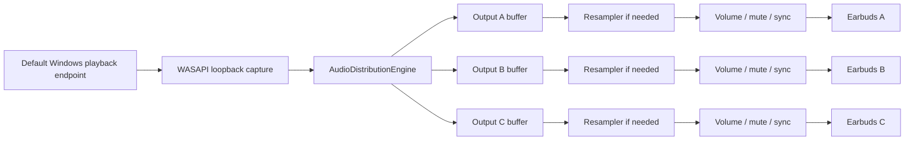

# MultiAudio Share

MultiAudio Share is a Windows 11 audio-routing project for sharing the same computer audio with multiple local playback endpoints such as Bluetooth earbuds, USB headsets, HDMI audio, or wired headphones.

The first implemented milestone is a real console proof of concept under `tools/MultiAudioShare.AudioTest`. It captures the current default Windows render endpoint with WASAPI loopback and fans the PCM stream out to selected render endpoints with independent software volume, mute, bounded buffering, resampling, and manual sync delay.

## Architecture



## Requirements

- Windows 11 x64
- .NET 8 SDK
- Active Windows audio render endpoints
- NAudio for WASAPI/Core Audio access

## Build

```powershell
dotnet restore
dotnet build
```

or:

```powershell
.\build.ps1
```

## Run The Audio Test

```powershell
dotnet run --project tools/MultiAudioShare.AudioTest/MultiAudioShare.AudioTest.csproj
```

or:

```powershell
.\run.ps1
```

The tool lists active render endpoints. Select listener endpoint indexes separated by commas, for example:

```text
1,2
```

Do not select the endpoint marked `default`. The current Phase 1 capture source records the default render endpoint, so routing back into that same endpoint could duplicate the app's own output. Later capture backends can relax this by separating source and listener routing more explicitly.

While sharing is running:

- `v <listener> <0-100>` changes independent device volume.
- `m <listener>` toggles mute for one listener.
- `s <listener> <0-1000>` changes manual sync delay in milliseconds.
- `stats` prints buffer and playback state.
- `q` stops sharing.

Listener numbers are one-based after startup. For example, `v 2 30` sets the second selected listener to 30%.

## Current Limitations

- This is the Phase 1 console utility, not the final WPF/WinUI dashboard.
- Capture currently follows the default Windows playback endpoint.
- Bluetooth concurrency is hardware, driver, and Windows-stack dependent.
- If an output endpoint fails to open, the program reports that failure instead of simulating success.
- Manual sync delay is implemented by buffering silence and realigning the output buffer.

## Project Structure

```text
src/MultiAudioShare.Core          Shared models and audio math
src/MultiAudioShare.Audio         Loopback capture and multi-output fan-out
src/MultiAudioShare.Devices       Windows render endpoint enumeration
src/MultiAudioShare.Infrastructure Logging and host helpers
tools/MultiAudioShare.AudioTest   Console proof-of-concept runner
tests/MultiAudioShare.Tests       Unit tests for hardware-free components
docs/                            User and engineering documentation
```

## Roadmap

1. Harden the console proof of concept on real two-device Bluetooth hardware.
2. Add hot-plug monitoring and reconnection.
3. Add persistent settings.
4. Build the WPF Windows 11 dashboard.
5. Add diagnostics UI and exportable reports.
6. Package for Windows 11 x64.
